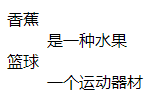
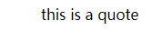
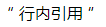
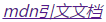
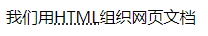
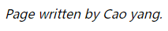
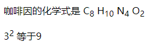
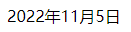

# 高阶文字排版

html 中有很多其他元素可以用于格式化文本

标记引文、描述列表、计算机代码和其他相关文本、下标和上标、联系信息等

## 描述列表 description list

- dt `description term` 描述术语
- dd `description definition` 描述部分

```html
<dl>
  <dt>香蕉</dt>
  <dd>是一种水果</dd>
  <dt>篮球</dt>
  <dd>一个运动器材</dd>
</dl>
```

页面效果：
::: info


:::

浏览器的默认样式会在描述部分和描述术语之间产生缩进

## 块引用

如果一个块级内容从其他地方被引用，可以用`<blockquote>`元素包起来。并且在 cite 属性里用 url 来指向引用的资源

```html
<blockquote cite="http:xxx">
  <div>this is a quote</div>
</blockquote>
```

页面效果：
::: info

:::

浏览器在渲染块引用是默认会增加缩进，作为引用的一个指示符

## 行内引用

和块引用方式相同，只是用`<q>`元素

```html
<div>
  <q cite="http:xxx">
    <span>行内引用</span>
  </q>
</div>
```

页面效果：
::: info

:::

浏览器默认将其作为普通文本放入引号内表示引用

## 引文

cite 属性不会被浏览器显示、屏幕阅读器阅读，需使用 js 或 css，浏览器才会显示 cite 的内容

```html
<p>
  <a
    href="https://developer.mozilla.org/zh-CN/docs/Learn/HTML/Introduction_to_HTML/Advanced_text_formatting"
  >
    <cite>mdn引文文档</cite>
  </a>
</p>
```

页面效果：
::: info
<a
href="https://developer.mozilla.org/zh-CN/docs/Learn/HTML/Introduction_to_HTML/Advanced_text_formatting">

</a>

:::

引文默认的字体样式为斜体

## 缩略语

`<abbr>`用来包裹一个缩略语或缩写，并提供 title 属性表示缩写的解释

```html
<p>我们用<abbr title="超文本标记语言">HTML</abbr>组织网页文档</p>
```

页面效果：
::: info

:::

## 标记联系方式

`<address>`标记编写 html 文档的人的联系方式，而不是其他任何内容

```html
<address>Page written by Cao yang.</address>
```

页面效果：
::: info


:::

## 上标和下标

当你使用日期、化学方程式和数学方程式是会偶尔使用上标和下标
`<sup>`和`<sub>`

```html
<p>咖啡因的化学式是 C<sub>8</sub> H<sub>10</sub> N<sub>4</sub> O<sub>2</sub></p>
<p>
  3<sup>2</sup>
  等于9
</p>
```

页面效果：
::: info


:::

## 标记时间和日期

`<time>`支持时间和日期标记为可供机器识别的格式

```html
<time datetime="2022-11-05"> 2022年11月5日</time>
```

页面效果：
::: info


:::
