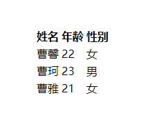
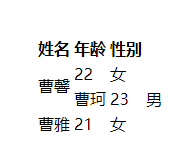
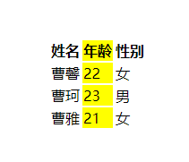
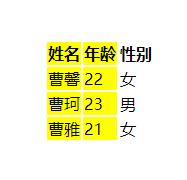
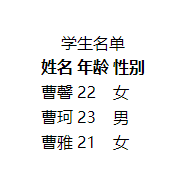
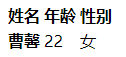

# html 表格

由行和列组成的结构化数据集（表格数据），它让你快速简单地查找某个表示不同类型数据之间的某种关系的值。

::: tip
表格的一个特点就是严格。通过在行和列的标题之间进行视觉关联的方法，就可以让信息能够很简单地被解读出来。
:::

## 表格风格

使用表格布局而不使用 CSS 布局技巧 是很糟糕的。理由有以下几个：

- 表格布局减少了视觉受损的用户的无障碍
- 表格会产生很多标签
- 表格不能自动响应

## 创建表格

- 每一个表格的内容都包含在这两个标签中：`<table></table>`。
- 表格的行，`<tr>(table row)` 元素
- 单元格，`<td>(table data)` 元素
- 为了将表格的标题在视觉上和语义上都能被识别为标题，使用 `<th> (table header)` 元素，用法和 `<td>`是一样的，只是这特表示为标题，而不是普通的单元格

::: tip
即使不给表格添加样式，表格标题也会带有一些默认样式：加粗和居中，让标题可以突出显示。
:::

```html
<table>
  <tr>
    <th>姓名</th>
    <th>年龄</th>
    <th>性别</th>
  </tr>
  <tr>
    <td>曹馨</td>
    <td>22</td>
    <td>女</td>
  </tr>
  <tr>
    <td>曹珂</td>
    <td>23</td>
    <td>男</td>
  </tr>
  <tr>
    <td>曹雅</td>
    <td>21</td>
    <td>女</td>
  </tr>
</table>
```

::: info 页面效果：

:::

## 单元格跨越多行和列

- `colspan` 跨行
- `rowspan` 跨列

```html
<table>
  <tr>
    <th>姓名</th>
    <th>年龄</th>
    <th>性别</th>
  </tr>
  <tr>
    <td rowspan="2">曹馨</td>
    <td>22</td>
    <td>女</td>
  </tr>
  <tr>
    <td colspan="1">曹珂</td>
    <td>23</td>
    <td>男</td>
  </tr>
  <tr>
    <td>曹雅</td>
    <td>21</td>
    <td>女</td>
  </tr>
</table>
```

::: info 页面效果：

:::

## 给表格列提供样式

`<col>` 元素被规定包含在 `<colgroup>` 容器中，而 `<colgroup>`就在 `<table>` 标签的下方。
每一个 `<col>` 都会指定每列的样式

```html
<table>
  <colgroup>
    <col />
    <col style="background-color: yellow" />
  </colgroup>

  ...
</table>
```

::: info 页面效果：

:::

## 给表格列提供相同样式

`span` 需要一个无单位的数字值，用来指定让这个样式应用到表格中多少列

```html
<table>
  <colgroup>
    <col style="background-color: yellow" span="2" />
  </colgroup>

  ...
</table>
```

::: info 页面效果：

:::

## `<caption>`表格标题

```html
<table>
  <caption>
    学生名单
  </caption>

  ...
</table>
```

::: info 页面效果：

:::

## `<thead>`, `<tfoot>`, 和 `<tbody>`

`<thead>`, `<tfoot>`,和 `<tbody>`, 这些元素把表格中的部分标记为表头、页脚、正文部分。

## `scope` 属性

可以添加在 `<th>` 元素中，用来帮助屏幕阅读设备更好地理解标题单元格

```html
<table>
  <thead>
    <tr>
      <th scope="col">姓名</th>
      <th scope="col">年龄</th>
      <th scope="col">性别</th>
    </tr>
  </thead>

  <tbody>
    <tr>
      <th scope="row">曹馨</th>
      <td>22</td>
      <td>女</td>
    </tr>
  </tbody>
  ...
</table>
```

屏幕阅读设备会识别这种结构化的标记，并一次读出整列或整行，scope 还有两个可选的值： colgroup 和 rowgroup。这些用于位于多个列或行的顶部的标题。

::: info 页面效果：

:::

## id 和标题属性

如果要替代 scope 属性，可以使用 id 和 headers 属性来创造标题与单元格之间的联系。

- 为每个`<th>` 元素添加一个唯一的 id
- 为每个`<td>` 元素添加一个 headers 属性。每个单元格的 headers 属性包含它从属于的所有标题的 id，之间用空格分隔开

```html
<table>
  <thead>
    <tr>
      <th id="name">姓名</th>
      <th id="age">年龄</th>
      <th id="sex">性别</th>
    </tr>
  </thead>

  <tbody>
    <tr>
      <th id="caoxin">曹馨</th>
      <td headers="age caoxin">22</td>
      <td headers="sex caoxin">女</td>
    </tr>
  </tbody>
</table>
```

::: tip
这个放进为标题单元格和数据单元格之间创造了非常精确的联系。但是这个方法使用了大量的标记，所以容错率比较低。使用 scope 的方法对于大多数表格来说，也够用了。
:::
