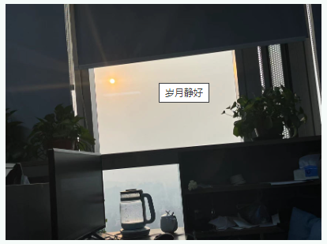

# 多媒体

## html 中的图片

用``元素把图片放在网页上，是一个空元素，最少只需要一个`src`(全称`source`)使其生效。

```html

```

::: info 页面效果：

:::

### 图片文件路径地址 `src`

包含了指向我们想要引入的图片的路径，可以是相对路径或绝对路径，就像`<a>`元素的`href`属性一样

### 备选文本 `alt`

对图片的文字描述，用于在图片无法显示或不能被看到的情况，向用户表达传递图像要表达的意思

为什么需要备选文本呢？

- 用户有视力障碍，通过屏幕阅读器来浏览网页
- 图片路径或文件名拼错
- 浏览器不支持该图片类型。例如 Lynx
- 提供一些文字描述给搜索引擎使用，搜索引擎可能会将图片的文字描述和查询条件匹配
- 用户关闭的图片显示以减少数据的传输，手机上十分普遍。

把路径故意写错，看`alt`的页面效果

```html

```

::: info 页面效果：

:::

### 宽度和高度

宽度和高度属性来指定图片的高度和宽度

### `title`图片标题

类似于超链接，可以给图片添加 title 属性来提供需要更进一步的支持信息。

鼠标悬停提示，看起来就像链接标题，效果截图如下：



## 视频和音频内容

### `<video>`元素

```html
<video src="./images/mv.mp4" width="200" controls>
  <p>
    你的浏览器不支持html5视频。 可点击
    <a href="rabbit320.mp4">从链接</a>观看
  </p>
</video>
```

::: info 页面效果：
<video src="./images/mv.mp4" width="200"   controls>

  <p>
    你的浏览器不支持html5视频。 可点击
    <a href="rabbit320.mp4">从链接</a>观看
  </p>
</video>
:::

### `src`

同``标签使用方式相同，`src`属性指向你想要嵌入网页当中的视频资源，他们的使用方式完全相同。

### `controls`

用户必须能够控制视频和音频的回放功能。可以使用 controls 来包含浏览器提供的控件界面，同时你也可以使用合适的

## 使用多个播放源以提高兼容性

有些视频在 Safari 或者 IE 浏览器上并不能播放，因为不同浏览器对视频格式的支持不同。

### 媒体文件的内容

- mp3、mp4、webm 这些术语叫做**容器格式**，他们定义了构成媒体文件的音频轨道和视频轨道的储存结构，其中包括描述这个媒体文件的元数据以及用于编码的编码译码器等等。

- 为了编解码器 codec 编码媒体，容器中的音频和视频轨道以合适的格式保存。

- 不同浏览器支持不同的视频和音频格式，以及不同的容器格式，这些格式又可以包含不同类型的视频和音频。

- 浏览器并不全支持相同的 codecs，所以的使用几个不同格式的文件来兼容不同的浏览器。如果使用的格式得不到浏览器的支持，那么媒体文件将不会播放。

```html
<video controls>
  <source src="rabbit320.mp4" type="video/mp4" />
  <source src="rabbit320.webm" type="video/webm" />
  <p>
    你的浏览器不支持HTML5视频。可点击 <a href="rabbit320.mp4">此链接</a>观看
  </p>
</video>
```

::: tip 注意
每个`<source>`标签页含有一个`type`属性，这个属性是可选的，最好是加上，它包含了视频文件的 MIME types，同时浏览器也会通过检查这个属性来迅速跳过那些不支持的格式。如果你没有添加 type 属性，浏览器会尝试加载每一个文件，直到找到一个能正确播放的格式，这样会消耗大量时间和资源。
:::

### `video`标签内的内容

这个叫作后备内容，当浏览器不支持`<video>`标签的时候，就会显示这段内容，这使得我们能对旧的浏览器提供回退内容。

html5 新特性：

### `width`和`height`

可以使用属性控制视频尺寸，也可以使用 css，无论使用哪种方式，视频都会保持他原始的长宽比，也叫做纵横比。

### `autoplay`

这个属性会使音频和视频内容立即播放，即使页面的其他部分还没有加载完全

### `loop`

这个属性可以让音频或视频文件循环播放

### `muted`

这个属性会导致媒体播放时，默认关闭声音

### `poster`

这个属性指向了一个图像的 URL，这个图象会在视频播放前显示。通常用于粗略的预览或者广告。

### `preload`

这个属性被用来缓冲较大的文件，有 3 个值可选：

- "none" ：不缓冲
- "auto"：页面加载后缓冲媒体文件
- "metadata"： 仅缓冲文件的元数据

### `<audio>`标签

`<audio>`标签与`<video>`标签的使用方式几乎完全相同，有一些细微的差别比如下面的边框不同，如下：

```html
<audio controls>
  <source src="viper.mp3" type="audio/mp3" />
  <source src="viper.ogg" type="audio/ogg" />
  <p>你的浏览器不支持HTML5视频。可点击 <a href="viper.mp3">此链接</a>观看</p>
</audio>
```

- `<audio>`不支持 with/height 属性，因为没有视觉部件
- 同时不支持 poster，同样，没有视觉部件

除此之外，`<audio>`支持所有`<video>`标签拥有的特性

### 重新播放媒体

可以在 js 中调用`load()`方法来重置媒体。如有多个由`<source>`标签指定的媒体来源，浏览器会从选择媒体来源开始重新加载媒体

### 音轨增删事件

监控媒体元素中的音频轨道，当音轨被添加或删除时，通过监听 AudioTrackList (en-US) 对象的 addtrack 事件（即 HTMLMediaElement.audioTracks 对象），你可以及时对音轨的增加做出响应。

```js
const mediaElem = document.querySelector("video");
mediaElem.audioTracks.onaddtrack = function (event) {
  audioTrackAdded(event.track);
};
```

### 显示音轨文本 `<track>`

被当作`<audio>`和`<video>`的子元素来使用
它允许指定时序文本字幕，例如自动处理字幕，字幕格式有(.vtt 格式文件)

`track` 给媒体元素添加的数据的类型在 `kind`属性中设置，属性值可以是 `subtitles`, `captions`, `descriptions`, `chapters` 或 `metadata`。该元素指向当用户请求额外的数据时浏览器公开的包含定时文本的源文件。

一个 `media` 元素的任意两个 `track` 子元素不能有相同的 `kind`, `srclang`, 和 `label` 属性。

```html
<video controls src="/media/cc0-videos/friday.mp4">
  <track
    default
    kind="captions"
    srclang="en"
    src="/media/examples/friday.vtt"
  />
  Download the
  <a href="/media/cc0-videos/friday.mp4">MP4</a>
  video, and
  <a href="/media/examples/friday.vtt">subtitles</a>.
</video>
```
