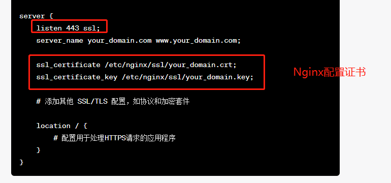

参考网站：https://kuangyx.cn/docs/%E6%9C%8D%E5%8A%A1%E7%AB%AF/%E9%83%A8%E7%BD%B2/nginx%E9%83%A8%E7%BD%B2%E5%89%8D%E7%AB%AF%E9%A1%B9%E7%9B%AE.html

一、安装 nginx

```sh
sudo apt update
sudo apt install nginx
```

二、启动 nginx

```sh
sudo systemctl start nginx # 启动 nginx
```

三、设置开机自启动

```sh
sudo systemctl enable nginx # 设置开机自启动
sudo systemctl is-enabled nginx # 验证nginx是否为自启动
```

当操作的权限不够时，以下命令可切换到 root 权限：

```sh
sudo su root # 切换到root权限
```

四、将前端本地打包后的 dist.zip 传输到服务器：

- MobaXterm 手动上传，zip 包上传，再解压
- 直接使用 scp 命令上传

编辑前端根目录下的`package.json下的scripts的scp`命令 ：

```js
 "scripts": {
    ...
  //                                              D：此处是本地打包后的文件路径                用户名@服务器ip:远程服务器的文件路径
    "deploy": "scp -r -o  GSSAPIAuthentication=no D:/company-project/video-detection/dist user@172.16.10.116:/var/www/html",
   ...
  },
```

之后运行`npm run deploy` 就可以将前端本地打包后的 dist 传输到服务器。

五、解压 dist 包

```sh
unzip FileName.zip          # 解压
```

如果将前端打包后的 dist 传到 `/var/www/html` 显示没有权限，可先传到`/home/user`，再移动到`/var/www/html`

```
mv /A文件路径xxx/ /b文件夹路径xxx/ # 将A文件移动到b文件夹下
```

六、打开配置文件`/etc/nginx/nginx.conf`

```sh
vi /etc/nginx/nginx.conf # 打开
```

七、编辑`/etc/nginx/nginx.conf`，如果提示不能写入，则修改文件权限

```sh
sudo chmod 777 文件名  # 将文件权限修改成可编辑
```

如果上传的文件夹和文件的位置不对，可以用以下命令删除文件和文件夹：

```sh
sudo rm -rf 文件夹 # 删除文件夹

sudo rm -f 文件 # 删除文件
```

文件权限修改之后，在`/etc/nginx/nginx.conf` 在这个文件的里面的`http`里面添加这些：

```nginx
server {
        #listen       8098; //端口号
        listen 443 ssl;   //https 默认写法
        server_name  localhost;

		//https 证书
        ssl_certificate /root/Intelligent_Captain/wenxin_websockets/ssl/public.crt;
        ssl_certificate_key /root/Intelligent_Captain/wenxin_websockets/ssl/private.key;

        location / {
            root   /var/www/html/dist; //dist包地址
            index  index.html index.htm;
            try_files $uri $uri/ /index.html;

        }
    }
```

因为是 https，所以需要加入 以下圈红的三行：

::: info

:::

八、检查写入的配置是否正确：

```sh
sudo nginx -t # 测试 nginx 配置是否正确
```

九、重启 nginx：

```sh
sudo systemctl reload nginx # 重启 nginx
```
